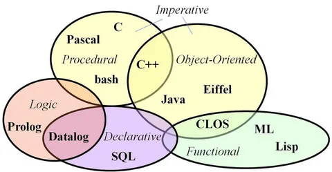

# Programming paradigms and paradigm languages

## GB homework

HW1: [«1. Искусственный интеллект. Обзор»](./hw1.py)

---

HW2: [«2. Структурное и процедурное программирование на практике»](./hw2.py)

---

HW3: [«3. ООП на практике»](./hw3.py)

---

HW4: [«4. Функциональное программирование»](./hw4.py)

---

HW4: [«5. Логическое программирование»](./hw5.py)

---

HW4: [«6. Парадигмы программирования на практике. Подведение итогов курса»](./hw6.py)
